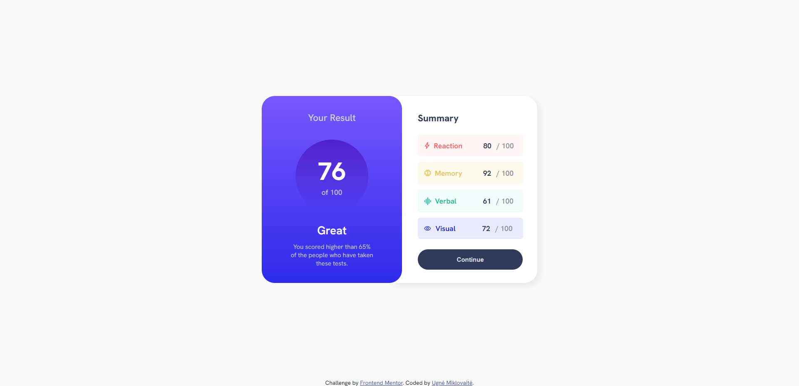
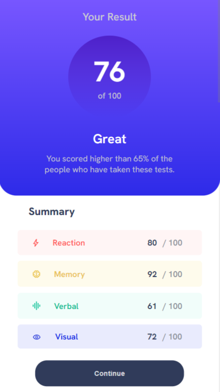

# Frontend Mentor - Results Summary Component

This is a responsive results summary component built with HTML and CSS. The design provides a clear summary of results with a focus on visual hierarchy and accessibility. This project was developed as part of a Frontend Mentor challenge to enhance skills in layout design and responsive web development.

## Features:
- Fully responsive layout optimized for both desktop and mobile devices
- Clear visual hierarchy for better user experience
- Clean design emphasizing accessibility and usability

## Screenshots:

### Desktop View 1:

### Desktop View 2:

### Mobile View:

Feel free to explore the project and provide feedback or suggestions for improvement!